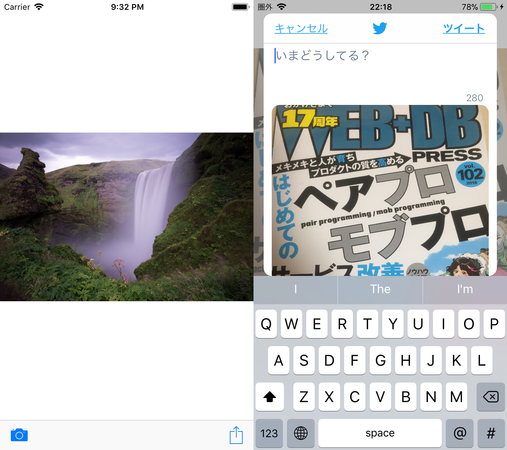
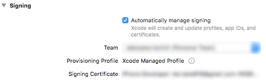

# MyCameraApp
📷

## About
WEB+DB PRESS Vol.104 に掲載されている「いきなりiPhoneアプリ開発 -カメラの写真を加工してTwitter投稿！-」特集内の「第3章：画像加工アプリを作ってみよう」におけるサンプルコードです。

※ 書面上のコードと一部改行位置が異なります

## Screen shots

## Features
- カメラで撮影した写真の取得
- Twitter連携

## Getting Started
cloneしたら、`MyCameraApp.xcodeproj`をXcodeで開いて下さい。

### 実機ビルド手順
本アプリはユーザーのプライバシー情報にアクセスするので、実機での動作確認を行います。

1. プロジェクト設定画面の「Signing → Team」のリストボックスから、登録済みのTeam名を選択
2. 「Team」を選択をすると下記の図のようにエラーが解消されていることを確認
3. 実機をPCと接続、端末を選択しRunする

## Requirements
- Xcode9.3+
- Swift4.1

## Author
Toshiki Takezawa

- [GitHub](https://github.com/to4iki)
- [Twitter](https://twitter.com/to4iki)
